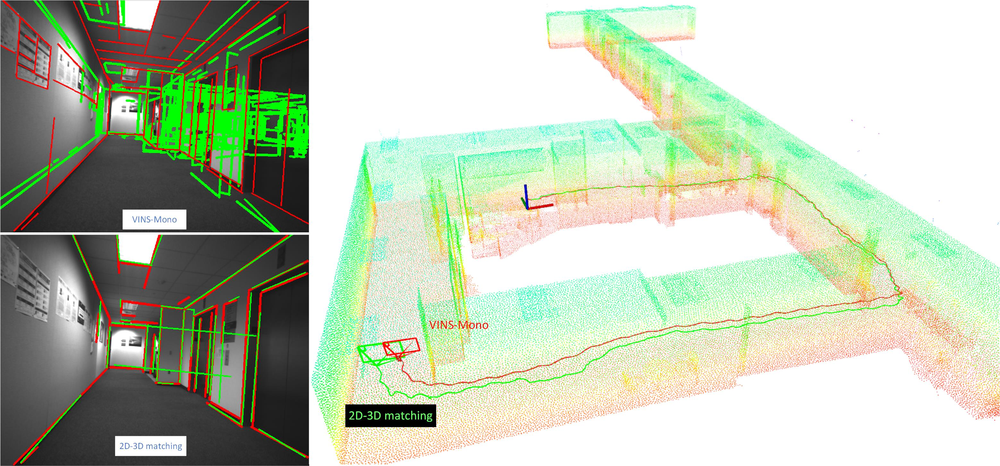
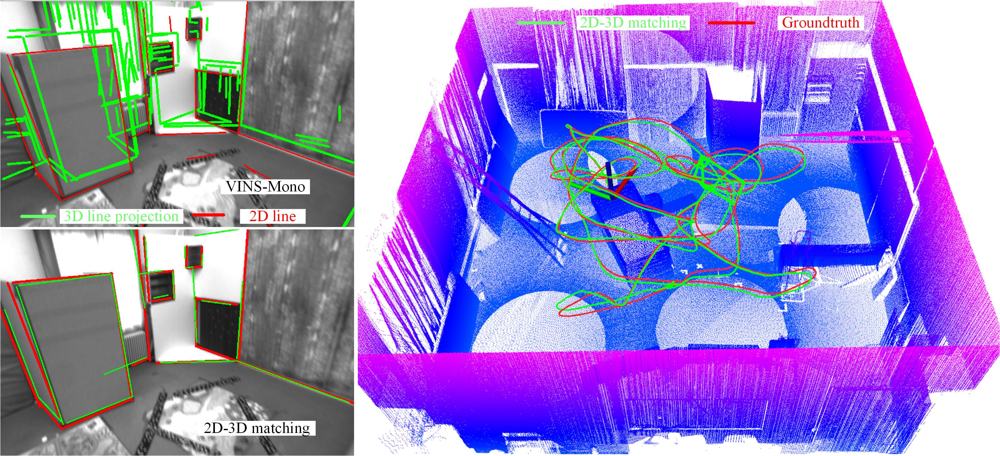

# 2D-3D pose tracking
## Monocular Camera Localization in Prior LiDAR Maps with 2D-3D Line Correspondences


The video demos can be seen: [Corridors](https://youtu.be/H80Bnxm8IPE) [EuRoC](https://youtu.be/mHaDKoIHNwI)

<a href="https://youtu.be/H80Bnxm8IPE" target="_blank"></a> 
<a href="https://youtu.be/mHaDKoIHNwI" target="_blank"></a>

2D-3D pose tracking is a real-time camera localization framework with prior LiDAR maps. It detects geometric 3D lines offline from LiDAR maps and use AFM to detect 2D lines from video sequences online. With the pose prediction from VIO, we can efficiently obtain coarse 2D-3D line correspondences. After that, camera poses and 2D-3D correspondences are iteratively optimized by minimizing the projection error of correspondences and rejecting outliers.  The 2D-3D correspondences greatly reduce the pose drifts of VIO system without using visual-revisiting loop
closure. This code runs on **Linux**. 

## 1. Prerequisites
1.1 **Ubuntu** and **ROS**.
Ubuntu  18.04.
ROS Melodic.

1.2 **python 2.7**, **CUDA** and **pytorch**.
Follow [CUDA Installation](https://docs.nvidia.com/cuda/cuda-installation-guide-linux/index.html) and [pytorch installation](https://pytorch.org/).

1.3. **Ceres Solver**.
Follow [Ceres Installation](http://ceres-solver.org/installation.html)

1.4 **VINS-Mono** Follow [VINS-Mono](https://github.com/HKUST-Aerial-Robotics/VINS-Mono) 

## 2. Build AFM line detection
The afm 2D line detection package is modified by the original [afm_cvpr2019](https://github.com/cherubicXN/afm_cvpr2019). Independent conda testing is strongly recommend. 
```
    cd catkin_ws/src/afm/scripts
    pip install -r requirements.txt
    pip install torch torchvision
    cd lib
    make
    cd ../../../../
    catkin_make
    source ~/catkin_ws/devel/setup.bash
```
## 3. 3D line detection
We follow [3D line detection](https://github.com/xiaohulugo/3DLineDetection) to detect geometric 3D lines and the results are included.

## 4. Build VINS-Mono on ROS
Clone the repository and catkin_make:
```
    cd ~/catkin_ws/src
    git clone https://github.com/HKUST-Aerial-Robotics/VINS-Mono.git
    cd ../
    catkin_make
    source ~/catkin_ws/devel/setup.bash
```

## 5. Testing On EuRoC dataset
Download [EuRoC MAV Dataset](http://projects.asl.ethz.ch/datasets/doku.php?id=kmavvisualinertialdatasets). Although it contains stereo cameras, we only use one camera.
Before testing, copy the new `vins_rviz_config.rviz` file to `VINS-Mono\config` path. Change the output frequency of VINS-Mono `VINS-Mono\config\euroc\euroc_config.yaml` to 15 Hz `freq: 15`. 

Open four terminals, launch the vins_estimator, map_fusion,  rviz and play the bag file respectively. Take V1_02_medium.bag for example
```
    roslaunch vins_estimator euroc.launch 
    roslaunch map_fusion euroc_tracking.launch
    roslaunch vins_estimator vins_rviz.launch
    rosbag play YOUR_PATH_TO_DATASET/V1_02_medium.bag
```

## 6. Testing on RealSense D435i data
Download [Corridors data](https://drive.google.com/file/d/1Ffke-wFpRifmw7nvcwQCreFm1S7fI3XR/view?usp=sharing)

To run VINS-Mono on this data, 
```
    cp src/2D-3D-pose-tracking/VINS-Mono-config/realsense_infra1_config.yaml src/VINS-Mono/config/realsense/
    cp src/2D-3D-pose-tracking/VINS-Mono-config/realsense_infra.launch src/VINS-Mono/vins_estimator/launch/
```
Then,
```
    roslaunch vins_estimator realsense_infra.launch 
    roslaunch map_fusion realsense_tracking.launch
    roslaunch vins_estimator vins_rviz.launch
    rosbag play YOUR_PATH_TO_DATASET/corridors.bag
```
## 7. Citation
```
@inproceedings{Yu2020MonocularCL,
  title={Monocular Camera Localization in Prior LiDAR Maps with 2D-3D Line Correspondences},
  author={Huai Yu and Weikun Zhen and Wen Yang and Ji Zhang and Sebastian Scherer},
  journal={arXiv preprint arXiv:2004.00740},
  year={2020}
}
```
## 8. Reference

[1] Qin, Tong, Peiliang Li, and Shaojie Shen. "Vins-mono: A robust and versatile monocular visual-inertial state estimator." IEEE Transactions on Robotics 34.4 (2018): 1004-1020.

[2] Xue, Nan, et al. "Learning attraction field representation for robust line segment detection." IEEE Conference on Computer Vision and Pattern Recognition. 2019.

[3] Lu, Xiaohu, Yahui Liu, and Kai Li. "Fast 3D Line Segment Detection From Unorganized Point Cloud." arXiv preprint arXiv:1901.02532 (2019).


